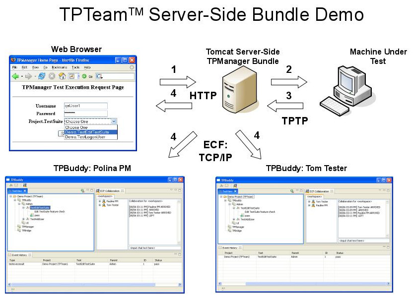

## TPTeam: a collaborative testing using Eclipse OSGi and XMPP chat protocol, embedded in Tomcat 

### Overview
The aim of TPTeam is to create an exemplary collaborative testing tool by using the Eclipse Equinox and Communication Framework (ECF) projects.This goal will be achieved by the development of three components: 
* TPBuddy™, a rich GUI client that is an Eclipse IDE plug-in (bundle).
* TPBridge™, an event-driven bundle that bridges communication across JVMs.  An Eclispe OSGi bundle.
* TPManager™, a test management bundle, part of an OSGi stack embedded in a Tomcat servlet container

All three components will utilize novel service-oriented architecture components derived from Equinox and distributed events to achieve collaborative unit testing. The proposed work represents a practical first step in utilizing newly available Eclipse open source projects for the creation of collaborative tools.

### Documentation
* [TPTeam Harvard Master's Thesis in Software Engineering, by Bob Brady](docs/pdf/BradyRobert_HarvardThesis.pdf?raw=true).  Includes installation and demo use case instructions.
* [TPTeam Eclipse World 2006 Presentation](docs/ppt/TPTeamEclipseWorld.ppt?raw=true).
* [TPTeam Distrubution](dist/).
* [TPTeam Original Website](https://sites.google.com/site/tpteameclipse/home)

### Example Workflow

### News
#### April 5, 2015
Ported the project source code from the now defunct Google code to GitHub.  Google did not export over the project artifacts and automatically deleted the entire project immediatedly after export.
Thanks Google! X(

#### September 22, 2007
Added the TPTeam Harvard Master's degree thesis to the downloads section. This thesis would be a good read for anyone interested in developing an Eclipse RCP app, connecting it to Hibenate, or embedding an Eclipse instance within a servlet container.

The thesis describes:

The state-of-the-art
Problem statement
General use cases
Domain model and design patterns used
User Manual
Lessons Learned

#### June 10, 2007
The first release, v0.1, is ready for download! Go to the downloads tab for more details. Each archive in the downloads section has a README that explains how to install, configure, and run.
